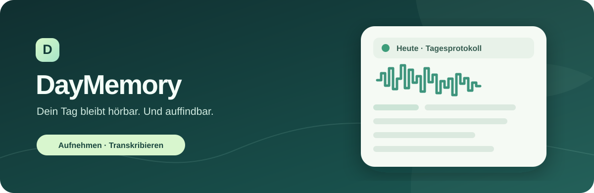

  

  # DayMemory

  **Aufnehmen. Lokal transkribieren. Den Tag wiederfinden.**

  
  
  
  

  [**APK herunterladen**](https://github.com/Schnitzelbeast/DayMemory-Android/raw/refs/heads/main/DayMemory-4.11-debug.apk) · [DayMemory Pro](https://daymemory-pro-portal.frosty-bun-3790.chatgpt.site/)

---

### Was DayMemory macht

| 🎙️ Aufnehmen | 📝 Transkribieren | ☁️ Sichern |
| :--- | :--- | :--- |
| Eine große Aufnahmetaste startet die Aufnahme. Längere Aufnahmen werden in 15-Minuten-Blöcke aufgeteilt. | Whisper verarbeitet abgeschlossene Blöcke direkt auf dem Android-Gerät. Tiny ist das Standardmodell. | Auf Wunsch lädt die App Audio und Transkripte in die eigene Dropbox hoch. |

Die App zeigt Aufnahme, Verarbeitung und Upload in den Einstellungen an. Eine Diagnoseansicht enthält Blockzahlen, Laufzeiten, Fehler und Warteschlangen. Ein Startbildschirm-Widget bietet schnellen Zugriff auf die Aufnahme.

### Installieren

1. [DayMemory 4.11 als APK herunterladen](https://github.com/Schnitzelbeast/DayMemory-Android/raw/refs/heads/main/DayMemory-4.11-debug.apk).
2. Auf einem **ARM64-Gerät mit Android 8.0 oder neuer** öffnen und die Installation aus dieser Quelle erlauben.
3. Mikrofon- und Benachrichtigungsberechtigung erteilen. Das Sprachmodell beim ersten Einsatz herunterladen.

> **Testversion:** Die Datei ist eine Debug-APK für direkte Installation. Sie ist keine Google-Play-Version. Android zeigt während der Aufnahme eine Mikrofonbenachrichtigung; Hintergrundarbeit kann durch Geräteeinstellungen beeinflusst werden.

### Deine Daten

Die Transkription läuft lokal auf dem Telefon. Eine Dropbox-Verbindung ist optional; bei aktivierter Verbindung verlassen die hochgeladenen Audio- und Textdateien das Gerät. Aufnahmen anderer Personen erfordern deren Einwilligung.

DayMemory verwendet ein gerätebezogenes Konto für den Probemonat und die Pro-Berechtigung. Das Konto und der Berechtigungsstatus werden über den DayMemory-Server verwaltet.

### Fragen zu deinen Aufnahmen

Die Transkripte liegen als lesbare Tagesdateien in Dropbox. Eine ChatGPT-Verknüpfung mit Dropbox ist **keine Voraussetzung für Aufnahme und Transkription**. Wer seine Transkripte in ChatGPT auswerten möchte, kann die betreffende Tagesdatei selbst hochladen. Eine direkte Suche in der App ist für diese Testversion nicht ausgewiesen.

### Download und Projektstand

Dieses öffentliche Repository enthält die **installierbare APK und diese Projektseite, keinen Android-Quellcode**. Die APK wird hier als Test-Build bereitgestellt. Eine Veröffentlichung bei Google Play erfordert einen gesonderten Release-Build und die Play-Store-Einrichtung.
